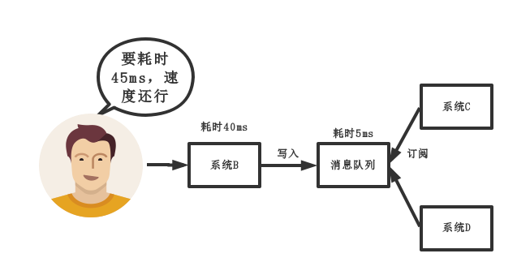
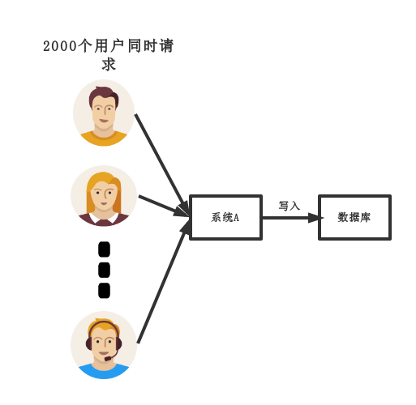
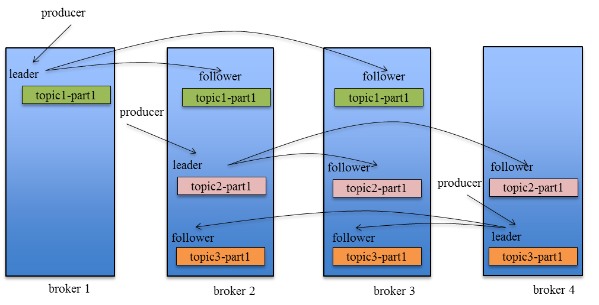

# 为什么要使用消息队列
解耦、异步、削峰 

1. 解耦  

传统模式：  
  
传统模式的缺点：  
系统间耦合性太强，如上图所示，系统A在代码中直接调用系统B和系统C的代码，如果将来系统D接入，系统A还需要修改代码，过于麻烦。  
中间件模式：  
  
中间件模式的优点：  
将消息写入消息队列，需要消息的系统自己从消息队列中订阅，从而系统A不需要做任何修改。  

2. 异步  

传统模式：  
  
传统模式的缺点：  
一些非必要的业务逻辑以同步的方式运行，太耗费时间。  
中间件模式：  
  
中间件模式的优点：  
将消息写入消息队列，非必要的业务逻辑以异步的方式运行，加快响应速度  

3. 削峰  

传统模式：  
  
传统模式的缺点：  
并发量大的时候，所有的请求直接怼到数据库，造成数据库连接异常  
中间件模式：  
  
中间件模式的优点：  
系统A慢慢的按照数据库能处理的并发量，从消息队列中慢慢拉取消息。在生产中，这个短暂的高峰期积压是允许的。  

## 使用了消息队列会有什么缺点  
* 系统可用性降低。本来其他系统只要运行的好好的，那你的系统就是正常的。现在非要加个消息队列进去，那消息队列挂了，你的系统也就完了。因此，系统可用性降低。  
* 系统复杂性增加。要多考虑很多方面的问题，比如一致性问题、如何保证消息不被重复消费，如何保证消息可靠传输。因此，需要考虑的东西更多，系统复杂性增大。  

## 消息队列如何选型
在此，只基于ActiveMQ，RabbitMQ，RocketMQ，Kafka进行讨论。    
特性 | ActiveMQ | RabbitMQ | RocketMQ | Kafka  
:-: | :-: | :-: | :-: | :-:
开发语言 | java | erlang | java | scala  
单机吞吐量 | 万级 | 万级 | 10万级 | 10万级  
时效性 | ms级 | us级 | ms级 | ms级以内  
可用性 | 高（主从架构） | 高（主从架构） | 非常高（分布式架构） | 非常高（分布式架构）  
功能特性 | 成熟的产品，在很多公司得到应用；有较多的文档；各种协议支持较好  | 基于erlang开发，所以并发能力很强，性能极其好，延时很低；管理界面较丰富  | MQ功能比较完备，扩展性佳 | 只支持主要的MQ功能，像一些消息查询，消息回溯等功能没有提供，毕竟是为大数据准备的，在大数据领域应用广  
综合上面的材料得出以下两点：  
1. 中小型软件公司，建议选择RabbitMQ。一方面，erlang语言天生具备高并发的特性，而且它的管理界面用起来十分方便。正所谓，成也萧何败萧何，它的弊端也在这里，虽然RabbitMQ是开源的，然而国内有几个能定制化开发erlang的程序员呢？所幸，RabbitMQ的社区十分活跃，可以解决开发过程中遇到的bug，这点对于中小型公司来说十分重要。不考虑RocketMQ和Kafka的原因是，一方面中小型软件公司不如互联网公司，数据量没有那么大，选消息中间件，应首选功能比较完备的，所以Kafka排除。不考虑RocketMQ的原因是，RocketMQ是阿里出品，如果阿里放弃维护RocketMQ，中小型公司一般抽不出人来进行RocketMQ的定制化开发，因此不推荐。  
2. 大型软件公司，根据具体使用在RocketMQ和Kafka之间二选一。一方面，大型软件公司，具备足够的资金搭建分布式环境，也具备足够大的数据量。针对RocketMQ，大型软件公司也可以抽出人手对RocketMQ进行定制化开发，毕竟国内有能力改JAVA源码的人，还是相当多的。至于Kafka，根据业务场景选择，如果有日志采集功能，肯定是首选kafka了。具体该选哪个，看使用场景。  

## 如何保证消息队列是高可用的  
以RocketMQ为例，它的集群就有多master模式、多master多slave异步复制模式、多master多slave同步双写模式。  
多master多slave模式部署架构图：  
  
通信过程如下：  
Producer与NameServer集群中的其中一个节点（随机选择）建立长连接，定期从NameServer获取Topic路由信息，并向提供Topic服务的Broker Master建立长连接，且定时向Broker发送心跳。Producer只能将消息发送到Broker Master，但是Consumer则不一样，它同时和提供Topic服务的Master和Slave建立长连接，既可以从Broker Master订阅消息，也可以从Broker Slave订阅消息。  
那么Kafka呢？为了对比说明，直接上Kafka的拓扑架构图  
  
如上图所示，一个典型的Kafka集群中包含若干Producer（可以是web前端产生的page view，或者服务器日志，系统CPU、Memory等），若干broker（kafka支持水平扩展，一般broker数量越多，集群吞吐率越高），若干Consumer Group，以及一个Zookeeper集群。kafka通过Zookeeper管理集群配置，选举leader，以及在Consumer Group发生变化时进行rebalance。Producer使用push模式将消息发布到broker，Consumer使用pull模式从broker订阅并消费消息。  
至于rabbitMQ，也有普通集群和镜像集群模式，自行去了解，比较简单。  
## 如何保证消息不被重复消费  
先来说一下为什么会造成重复消费。  
其实无论是哪种消息队列， 造成重复消费的原因其实都是类似的。正常情况下，消费者在消费消息的时候，消费完毕后，会发送一个确认消息给消息队列，消息队列就知道该消息被消费了，就会将该消息从消息队列中删除。只是不同的消息队列发送的确认信息形式不同，例如RabbitMQ是发送一个ACK确认消息，RocketMQ是返回一个CONSUME_SUCCESS成功标志，kafka实际上有个offset的概念，简单说一下，就是每一个消息都有一个offset，kafka消费过消息后，需要提交offset，让消息队列知道自己已经消费过了。那造成重复消费的原因？就是因为网络传输等等故障，确认消息没有传送到消息队列， 导致消息队列不知道自己已经消费过该消息了，再次将该消息分发给其他的消费者。  
如何解决？这个问题针对业务场景来回答分为以下几点：  
1. 比如，你拿到这个消息做数据库insert操作，那就容易了，给这个消息做一个唯一主键，那么就算出现重复消费的情况，就会导致主键冲突，避免数据库出现脏数据。  
2. 再比如，你拿这个消息做redis的set的操作，那就容易了，不用解决，因为你无论set几次结果都是一样的，set操作本来就算幂等操作。  
3. 如果上面两种情况还不行，上大招。准备一个第三方介质，来做消费记录。以redis为例，给消息分配一个全局id，只要消费过该消息，将<id,message>以K-V形式写入redis。那消费者开始消费前，先去redis中查询有没有消费记录即可。  

## 如何保证消费的可靠性传输
每种MQ都要从三个角度来分析：生产者弄丢数据、消息队列弄丢数据、消费者弄丢数据。  
### RabbitMQ 
1. 生产者丢数据  

从生产者弄丢数据这个角度来看，RabbitMQ提供transaction和confirm模式来确保生产者不丢消息。  
transaction机制就是说，发送消息前，开启事务（channel.txSelect()），然后发送消息，如果发送过程中出现什么异常，事务就会回滚（channel.txRollback()），如果发送成功则提交事务（channel.txCommit()）。  
然而缺点就是吞吐量下降了。因此，生产上用confirm模式的居多。一旦channel进入confirm模式，所有在该信道上面发布的消息都将会被指派一个唯一的ID（从1开始），一旦消息被投递到所有匹配的队列之后，RabbitMQ就会发送一个ACK给生产者（包含消息的唯一ID），这就使得生产者知道消息已经正确到达目的队列了。如果RabbitMQ没能处理该消息，则会发送一个NACK消息给你，你可以进行重试操作。  

2. 消息队列丢数据  

处理消息队列丢数据的情况，一般是开启持久化磁盘的配置。这个持久化配置可以和confirm机制配合使用，你可以在消息持久化磁盘后，再给生产者发送一个ACK信号。这样，如果消息持久化磁盘之前，RabbitMQ阵亡了，那么生产者收不到ACK信号，生产者会自动重发。  
那么如何持久化呢，这里顺便说一下吧，其实也很容易，就下面两步  
* 将queue的持久化标志durable设置为true，则代表是一个持久的队列
* 发送消息的时候将deliveryMode = 2

这样设置以后，RabbitMQ就算挂了，重启后也能恢复数据  

3. 消费者丢数据  

消费者丢数据一般是因为采用了自动确认消息模式。这种模式下，消费者会自动确认收到信息。这时RabbitMQ会立即将消息删除，这种情况下如果消费者出现异常而没能处理该消息，就会丢失该消息。  
至于解决方案，采用手动确认消息即可。  

### kafka  
这里先引用一张kafka Replication的数据流向图  
  
Producer在发布消息到某个Partition时，先通过Zookeeper找到该Partition的Leader，然后无论该Topic的Replication Factor为多少（也即该Partition有多少个Replica），Producer只将该消息发送到该Partition的Leader。Leader会将该消息写入其本地Log。每个Follower都将从Leader中Pull数据。  
针对上述情况，得出如下分析  
1. 生产者丢数据  

在kafka生产中，基本都有一个leader和多个follower。follower会去同步leader的信息。因此，为了避免生产者丢数据，做如下两点配置  
* 第一个配置要在producer端设置acks=all，这个配置保证了，follower同步完成后，才认为消息发送成功。  
* 在producer端设置retries=MAX，一旦写入失败，将无限重试  

2. 消息队列丢数据  

针对消息队列丢数据的情况，无外乎就是，数据还没同步，leader就挂了，这时zookeeper会将其他的follower切换为leader，那数据就丢失了。针对这种情况，应该做两个配置。  
* replication.factor参数，这个值必须大于1，即要求每个partition必须有至少2个副本
* min.insync.replicas参数，这个值必须大于1，这个是要求一个leader至少感知到有至少一个follower还跟自己保持联系  

这两个配置加上上面生产者的配置联合起来用，基本可确保kafka不丢数据  

3. 消费者丢数据  

这种情况一般是自动提交了offset，然后你处理程序过程中挂了。kafka以为你处理好了。  
offset：指的是kafka的topic中的每个消费组消费的下标。简单的来说就是一条消息对应一个offset下标，每次消费数据的时候如果提交offset，那么下次消费就会从提交的offset加1那里开始消费。  
比如一个topic中有100条数据，我消费了50条并且提交了，那么此时的kafka服务端记录提交的offset就是49（offset从0开始），那么下次消费的时候offset就从50开始消费。  
解决方案也很简单，改成手动提交即可。  

## 如何保证消息的顺序性
针对这个问题，通过某种算法，将需要保持先后顺序的消息放到同一个消息队列中（kafka中就是partition，RabbitMQ中就是queue）。然后只用一个消费者去消费该队列。  
有的人会问：那如果为了吞吐量，有多个消费者去消费怎么办？  
这个问题，没有固定回答的套路。比如我们有一个微博的操作，发微博、写评论、删除微博，这三个异步操作。如果是这样一个业务场景，那只要重试就行。比如你一个消费者先执行了写评论的操作，但是这时候，微博都还没发，写评论一定是失败的，等一段时间，等另一个消费者，先执行发微博的操作后，再执行写评论，就可以成功。  
总之，针对这个问题，我的观点是保证入队有序就行，出队以后的顺序就交给消费者自己去保证，没有固定套路。