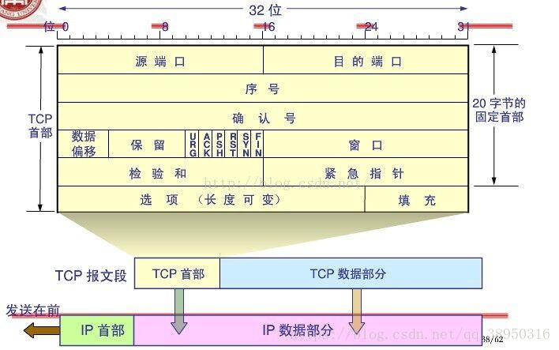
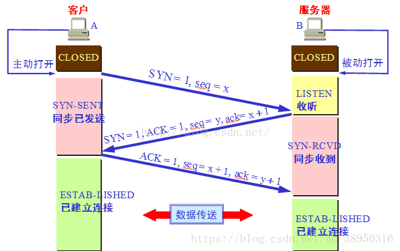
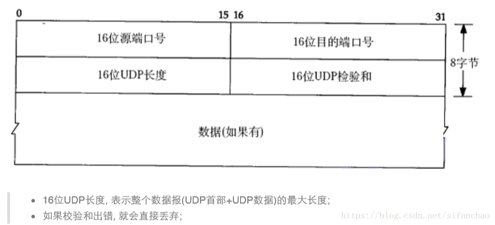
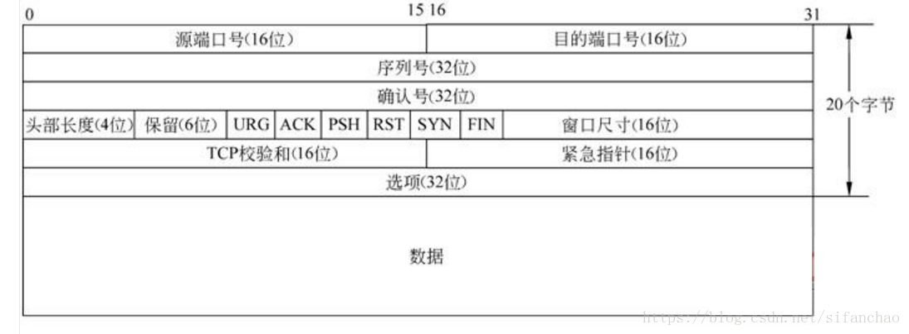
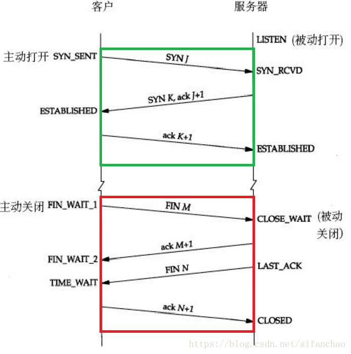

# TCP的三次握手与四次挥手
TCP工作在网络OSI的七层模型中的第四层——传输层，IP在第三层——网络层，ARP在第二层——数据链路层。  
在第二层上的数据，我们把它叫做帧，在第三层上的数据叫包，第四层的数据叫段。  
数据从应用层发下来，会在每一次的头部加上信息，进行封装，然后再发送到数据接收端。也就是每个数据都会经过封装和解封装的过程。在OSI七层模型中，每一层的作用和对应的协议如下：  
OSI中的层 | 功能 | 协议族  
:-: | :-: | :-:  
应用层 | 文件传输，电子邮件，文件服务，虚拟终端 | TFTP，HTTP，SNMP，FTP，SMTP，DNS，Telnet  
表示层 | 数据格式化，代码转换，数据加密 | 没有协议  
会话层 | 解除或建立与别的节点的联系 | 没有协议  
传输层 | 提供端对端的接口 | TCP，UDP  
网络层 | 为数据包选择路由 | IP，ICMP，RIP，OSPF，BGP，IGMP  
数据链路层 | 传输有地址的帧以及错误检测功能 | SLIP，CSLIP，PPP，ARP，RARP，MTU  
物理层 | 以二进制数据形式在物理媒体上传输数据 | ISO2110，IEEE802，IEEE802.2  
  
序列号seq：占4个字节，用来标记数据段的顺序，TCP把连接中发送的所有数据字节都编上一个序号，第一个字节的序号由本地随机产生；给字节编上序号后，就给每一个报文段指派一个序号；序列号seq就是这个报文段中的第一个字节的数据编号。  
确认号ack：占4个字节，期待收到对方下一个报文段的第一个数据字节的序号；序列号表示报文段携带数据的第一个字节的编号；而确认号指的是期望接收到下一个字节的编号；因此当前报文段最后一个字节的编号+1即为确认号。  
确认ACK：占1位，仅当ACK=1时，确认号字段才有效。ACK=0时，确认号无效。  
同步SYN：连接建立时用于同步序号。当SYN=1，ACK=0时表示，这是一个连接请求报文段。若同意连接，则在响应报文段中使SYN=1，ACK=1.因此SYN=1表示这是一个连接请求，或连接接受报文。SYN这个标志位只有在TCP建立连接时才会被置为1，握手完成后SYN标志位被置为0。  
终止FIN：用来释放一个连接。FIN=1表示，此报文段的发送方数据已经发送完毕，并要求释放运输连接。  
PS：ACK、SYN和FIN这些大写的单词表示标志位，其值要么是1，要么是0，ack、seq小写的单词表示序号。  
字段 | 含义  
:-: | :-:  
URG | 紧急指针是否有效。为1，表示某一位需要被优先处理  
ACK | 确认号是否有效，一般置为1  
PSH | 提示接收端应用程序立即从TCP缓冲区把数据读走  
RST | 对方要求重新建立连接，复位  
SYN | 请求建立连接，并在其序列号的字段进行序列号的初始值设定。建立连接，设置为1  
FIN | 希望断开连接    
## 三次握手
第一次握手：主机A发送位码为SYN=1，随机产生seq number=x的数据包到服务器，客户端进入SYN_SEND状态，等待服务器的确认；主机B由SYN=1知道，A要求建立联机。  
第二次握手：主机B收到请求后要确认联机信息，向A发送ack number（主机A的seq+1），SYN=1，ACK=1，随机产生seq=y的包，此时服务器进入SYN_RECV（半连接）状态；  
第三次握手：主机A收到后检查ack number是否正确，即第一次发送的seq number+1，以及位码ACK是否为1，若正确，主机A会再发送ack number（主机B的seq+1），ACK=1，主机B收到后确认seq值与ACK=1则连接建立成功，完成TCP三次握手。  
TCP位码，有6种标示：SYN（synchronous建立联机）、ACK（acknowledgement确认）、PSH（push传送）、FIN（finish结束）、RST（reset重置）、URG（urgent紧急）、Sequence number（顺序号码）、Acknowledge number（确认号码）。  
    
## 四次挥手
1. 客户端进程发出连接释放报文，并且停止发送数据。释放数据报文首部，FIN=1，其序列号为seq=u（等于前面已经传送过来的数据的最后一个字节的序号加1），此时，客户端进入FIN_WAIT_1（终止等待1）状态。TCP规定，FIN报文即使不携带数据，也要消耗一个序号。    
2. 服务器收到连接释放报文，发出确认报文，ACK=1，ack=u+1，并且带上自己的序列号seq=v，此时，服务端就进入了CLOSE_WAIT（关闭等待）状态。TCP服务器通知高层的应用进程，客户端向服务器的方向就释放了，这时候处于半关闭状态，即客户端已经没有数据要发送了，但是服务器若发送数据，客户端依然要接受。这个状态还要持续一段时间，也就是整个CLOSE_WAIT状态持续的时间。  
3. 客户端收到服务器的确认请求后，此时，客户端就进入FIN_WAIT_2（终止等待2）状态，等待服务器发送链接释放报文（在这之前还需要接受服务器发送的最后的数据）。  
4. 服务器将最后的数据发送完毕后，就向客户端发送连接释放报文，FIN=1，ack=u+1，由于在半关闭状态，服务器很可能又发送了一些数据，假定此时的序列号为seq=w，此时服务器就进入了LAST_ACK（最后确认）状态，等待客户端的确认。  
5. 客户端收到服务器的连接释放报文后，必须发出确认，ACK=1，ack=w+1，而自己的序列号是seq=u+1，此时，客户端就进入了TIME_WAIT（时间等待）状态。注意此时TCP连接还没有释放，必须经过2*MSL（最长报文段寿命）的时间后，当客户端撤销相应的TCB后，才进入CLOSED状态。  
6. 服务器只要收到了客户端发出的确认，立即进入CLOSED状态。同样，撤销TCP后，就结束了这次的TCP连接。可以看到，服务器结束TCP连接的时间要比客户端早一些。   

# 常见面试题  
1. 为什么连接的时候是三次握手，关闭的时候却是四次挥手？  

因为当Server端收到Client端的SYN连接请求报文后，可以直接发送SYN+ACK报文。其中ACK报文是用来应答的，SYN报文是用来同步的。但是关闭连接时，当Server端收到FIN报文时，很可能并不会立即关闭SOCKET，所以只能先回复一个ACK报文，告诉Client端，“你发的FIN报文我收到了”。只有等到我Server端所有的报文都发送完了，我才能发送FIN报文，因此不能一起发送。故需要四步握手。    
2. 为什么TIME_WAIT状态需要经过2MSL（最大报文段生存时间）才能返回到CLOSE状态？  

虽然按道理，四个报文都发送完毕，我们就可以直接进入CLOSE状态了，但是我们必须假想网络是不可靠的，有可能最后一个ACK丢失。所以TIME_WAIT状态就是用来重发可能丢失的ACK报文。在Client发送出最后的ACK回复，但该ACK可能丢失。Server如果没有收到ACK，将不断重复发送FIN片段。所以Client不能立即关闭，它必须确认Server接收到了该ACK。Client会在发送出ACK之后进入到TIME_WAIT状态。Client会设置一个计时器，等待2MSL的时间。如果在该时间内再次收到FIN，那么Client会重发ACK并再次等待2MSL。所谓的2MSL是两倍的MSL（Maximum Segment Lifetime）。MSL指一个片段在网络中最大的存活时间，2MSL就是一个发送和一个回复所需的最大时间。如果直到2MSL，Client都没有再次收到FIN，那么Client推断ACK已经被成功接收，则结束TCP连接。

# UDP和TCP的区别
* 相同点    
  UDP协议和TCP协议都是传输层协议。  
  TCP（Transmission Control Protocol，传输控制协议）提供的是面向连接，可靠的字节流服务。即客户和服务器交换数据前，必须先在双方之间建立一个TCP链接，之后才能传输数据。并且提供超时重发，丢弃重复数据，检验数据，流量控制等功能，保证数据能从一端传到另一端。     
  UDP（User DataProtocol，用户数据报协议）是一个简单的面向数据报的传输层协议。它不提供可靠性，只是把应用程序传给IP层的数据报发送出去，但是不能保证它们能到达目的地。由于UDP在传输数据报前不用在客户和服务器之间建立一个链接，且没有超时重发等机制，所以传输速度很快。
* 不同点  
  * 报头不同
  * 特点不同
  * 协议不同

* UDP
  * 报头  
    
    UDP数据报最大长度64K（包含UDP首部），如果数据长度超过64K就需要在应用层手动分包，UDP无法保证包序，需要在应用层进行编号。
  * 特点
    1. 无连接：知道对端的IP和端口号就直接进行传输，不需要建立连接。
    2. 不可靠：没有确认机制，没有重传机制；如果因为网络故障，该段无法发送给对方，UDP协议层也不会给应用层返回任何错误信息。
    3. 面向数据报：不能够灵活地控制读写数据的次数和数量，应用层交给UDP多长的报文，UDP原样发送，既不会拆分，也不会合并。
    4. 数据报不够灵活，但是能够明确区分两个数据报，避免粘包的问题。

  * 协议
    * NFS：网络文件系统
    * TFTP：简单文件传输协议
    * DHCP：动态主机配置协议
    * BOOTP：启动协议（用于无盘设备启动）
    * DNS：域名解析协议

* TCP
  * 报头
    
    * 源/目的端口号：表示数据是从哪个进程来，到哪个进城去；
    * 32位序号/32位确认号：不一定从0开始（作用：保证确认应答；保证数据按序到达；去重）
    * 4位TCP报头长度：表示该TCP头部有多少个32位bit（有多少个4字节）；所以TCP报头最大长度是15*4=60字节
    * 6位标志位：
        1. URG：紧急指针是否有效
        2. ACK：确认号是否有效
        3. PSH：提示接收端应用程序立刻从TCP缓冲区把数据读走
        4. RST：对方要求重新建立连接；我们把携带RST标识的称为复位报文段
        5. SYN：请求建立连接；我们把携带SYN标识的称为同步报文段
        6. FIN：通知对方，本端要关闭了，我们称携带FIN标识的为结束报文段
    * 16位窗口大小：接收缓冲区剩余的空间大小
    * 16位校验和：发送端填充，CRC校验，接收端校验不通过，则认为数据有问题。此处的校验和不光包括TCP首部，也包含TCP数据部分。
    * 16位紧急指针：标识哪部分数据是紧急数据。
  * 特点
    * 面向连接
    
    * 可靠传输
    序列号 确认应答 超时重传 拥塞控制
    1. 确认应答机制&序列号      
    TCP将每个字节的数据都进行了编号，即为序列号。  
    每一个ACk都带有对应的确认序列号，意思是告诉发送者，我已经收到了哪些数据，下一次你从哪里开始发送。
    2. 超时重传&序列号  
    主机A发送数据给BOSS之后，可能因为网络拥堵等原因，数据无法到达主机B；如果主机A在一个特定时间间隔内没有收到B发送来的确认应答，就会进行重发；  
    主机A未收到B发来的确认应答，也可能是因为ACK丢失了，因此主机B会收到很多重复数据。那么TCP协议需要能够识别出哪些包是重复的包，并且把重复的丢弃掉。这时候我们可以利用序列号，就很容易做到去重的效果。  
        
    **超时时间确认**

        超时是指在重发数据之前，等待确认应答到来的那个特定时间间隔。如果在超过这个时间间隔仍未收到ACK，发送端就进行数据包重发。

        那么, 超时的时间如何确定?
        最理想的情况下, 找到一个最小的时间, 保证 “确认应答一定能在这个时间内返回”.但是这个时间的长短, 随着网络环境的不同, 是有差异的。如果超时时间设的太长, 会影响整体的重传效率;如果超时时间设的太短, 有可能会频繁发送重复的包。

        TCP为了保证无论在任何环境下都能比较高性能的通信, 因此会动态计算这个最大超时时间。
        Linux中(BSD Unix和Windows也是如此), 超时以500ms为一个单位进行控制, 每次判定超时重发的超时时间都是500ms的整数倍。如果重发一次之后, 仍然得不到应答, 等待 2*500ms 后再进行重传.如果仍然得不到应答, 等待 4*500ms 进行重传. 依次类推,
        以指数形式递增.累计到一定的重传次数, TCP认为网络或者对端主机出现异常, 强制关闭连接。并且通知应用通信异常强行终止。
    3. 拥塞控制  
    每次发送数据报的时候，将拥塞窗口和接收端主机反馈的窗口大小作比较，取较小的值作为实际发送的窗口。  
    拥塞控制，归根结底是TCP协议想尽可能快地把数据传输给对方，但是又要避免给网络造成太大压力的折中方案。  
    **提高传输效率：** 滑动窗口、流量控制、延迟应答、捎带应答  
    **滑动窗口机制**
        1. 窗口大小指的是无需等待确认应答而可以继续发送数据的最大值
        2. 发送窗口内字段的时候，不需要等待任何ACK，直接发送
        3. 收到第一个ACK后，滑动窗口向后移动，继续发送下一个窗口字段的数据，以此类推
        4. 操作系统内核为了维护这个滑动窗口，需要开辟发送缓冲区来记录当前还有哪些数据没有应答；只有确认应答过的数据，才能从缓冲区删掉
        5. 窗口越大，则网络的吞吐率就越高    
   
   
     **流量控制**  
     接收端处理数据的速度是有限的，如果发送端发的太快，导致接收端的缓冲区被打满，这个时候如果发送端继续发送，就会造成丢包，继而引起丢包重传等等一系列连锁反应。  
       1. 接收端将自己可以接受的缓冲区大小放入TCP首部中的”窗口大小“字段，通过ACK端通知发送端
       2. 窗口大小字段越大，说明网络的吞吐量越高
       3. 接收端一旦发现自己的缓冲区快满了，就会将窗口大小设置成一个更小的值通知发送端
       4. 发送端接收到这个窗口之后，就会减慢自己的发送速度
       5. 如果接收端缓冲区满了，就会将窗口置为0，这时发送端不再发送数据，但是需要定期发送一个窗口  
    
    **延迟应答**  
    如果接收数据的主机立刻返回ACK应答，这时候返回的窗口可能比较小  
    窗口越大，网络吞吐量就越大，传输效率就越高，我们的目标是在保证网络不拥塞的情况下，尽量提高传输效率  

    **捎带应答**  
    在延迟应答的基础上，我们发现，很多情况下，客户端服务器在应用层也是”一发一收“的。  
    意味着客户端给服务器说了”How are you“，服务器也会给客户端回一个”Fine， thank you“；那么这个时候ACK就可以搭顺风车，和服务器回应的”Fine， thank you“一起回给客户端。  

  * 面向字节流：  
  创建一个TCP的socket，同时在内核中创建一个发送缓冲区和一个接收缓冲区；
  另一方面，TCP的一个链接，既有发送缓冲区，也有接收缓冲区，那么对于这一个连接，既可以读数据，也可以写数据。这个概念叫做全双工。
    1. 调用write时，数据会先写入发送缓冲区中
    2. 如果发送的字节数太长，会被拆分成多个TCP的数据包发出；如果发送的字节数太短，就会先在缓冲区里等待，等到缓冲区长度差不多了，或者其他合适的时机发送出去
    3. 接收数据的时候，数据也是从网卡驱动程序到达内核的接收缓冲区
    4. 然后应用程序可以调用read从接收缓冲区拿数据  
   
  * TCP粘包问题  
    1. 首先要明确，粘包问题中的”包“，指的是应用层的数据包
    2. 在TCP的协议头中，没有如同UDP一样的”报文长度“这样的字段，但是有一个序号这样的字段
    3. 站在传输层的角度，TCP是一个一个报文过来的，按照序号排好序放在缓冲区中
    4. 站在应用层的角度，看到的只是一连串的连续的字节数据，那么应用程序看到了这么一连串的字节数据，就不知道从哪个部分开始到哪个部分是一个完整的应用层数据包  
  * 那么如何避免粘包问题呢？归根结底就是一句话，明确两个包之间的边界
    1. 对于定长的包，保证每次都按固定大小读取即可
    2. 对于变长的包，可以在报头的位置，约定一个包总长度的字段，从而就知道了包的结束位置
    3. 对于变长的包，还可以在包和包之间使用明确的分隔符
    4. TLV格式的数据传输  
  * TCP异常的情况
    1. 进程终止：进程终止会释放文件描述符，仍然可以发送FIN，和正常关闭没有什么区别
    2. 机器重启：和进程终止的情况相同
    3. 机器掉电/网线断开：接收端认为连接还在，一旦接收端有写入操作，接收端发现连接已经不在了，就会进行reset。即使没有写入操作，TCP自己也内置了一个保活定时器，会定期询问对方是否还在，如果对方不在，也会把连接释放  
   * 协议  
    1. HTTP
    2. HTTPS
    3. SSH
    4. Telenet
    5. FTP
    6. SMTP